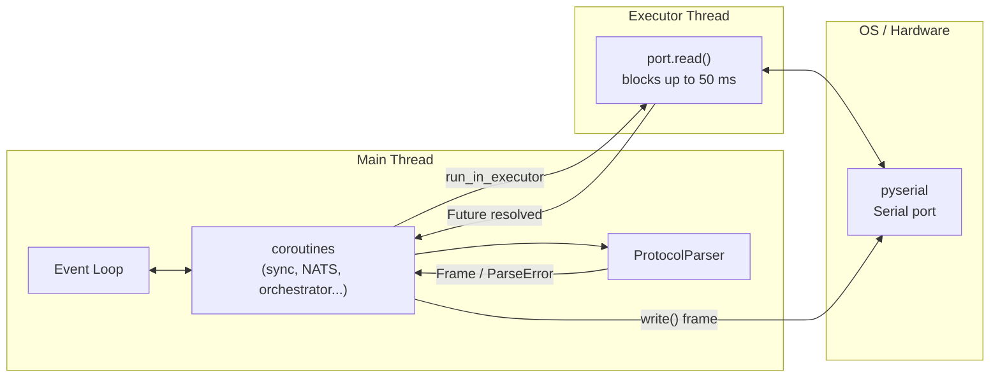
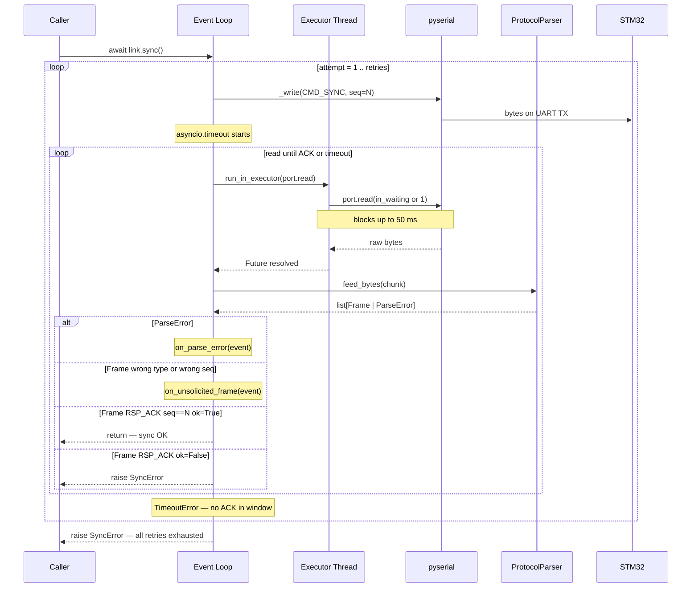
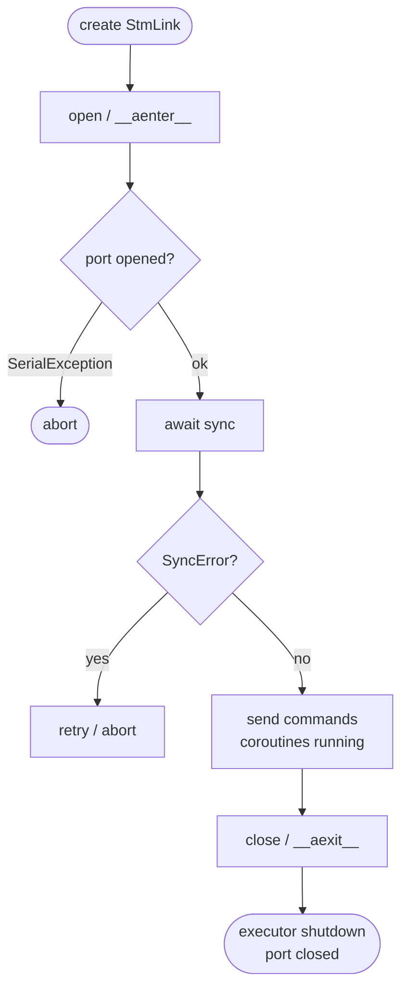

# StmLink — Serial Bridge to the STM32

`bbb/comms/stm_link.py`

Wraps a pyserial port with an asyncio-friendly interface and provides the
startup synchronization handshake (CMD_SYNC). The core challenge is that
pyserial's `read()` is a blocking call, which cannot run directly on the
asyncio event loop without freezing the whole BBB agent.

---

## Concurrency Model

The BBB agent is single-process, single-event-loop. All async tasks
(NATS, serial bridge, orchestrator) share that one loop running on the
**main thread**.

pyserial's `read()` is a blocking OS call. Running it directly on the
event loop would stall every other coroutine for up to 50 ms per call.
To avoid this, `StmLink` offloads every `read()` to a
**`ThreadPoolExecutor` with one worker thread**.



**Why one worker thread?**
Serial reads must be serialised — two concurrent `read()` calls on the
same port would race and split bytes across futures. `max_workers=1`
makes that structurally impossible.

**Why is `_write` synchronous?**
A single protocol frame is at most 263 bytes (7 overhead + 256 payload).
At 115200 baud that transmits in ~23 ms, well within the OS transmit
buffer, so `write()` returns immediately without blocking the event loop
in practice.

---

## Startup Sync Flow

At boot the STM32 may be mid-reset, still booting, or transmitting noise.
`sync()` sends **CMD_SYNC** repeatedly until a matching **RSP_ACK** comes
back — or raises `SyncError` when all retries are exhausted.



---

## Why Seq Matching Matters

Each retry calls `seq.next()`, so attempts use different sequence numbers.
If a delayed ACK from attempt N arrives during attempt N+1,
`event.seq != sent_seq` discards it silently.

Without seq matching, a slow STM32 response could satisfy the wrong
retry and return a false success.

```
attempt 1: sent_seq=0  →  timeout (STM32 still booting)
attempt 2: sent_seq=1  →  ACK(seq=0) arrives  ← discarded (wrong seq)
                       →  ACK(seq=1) arrives  ← accepted ✓
```

---

## asyncio.timeout vs manual deadline

```python
# What we do — clean, cancellation-safe
async with asyncio.timeout(timeout_s):
    while True:
        chunk = await self._read()
        ...

# What we avoid
deadline = loop.time() + timeout_s
while loop.time() < deadline:         # busy-checks wall time
    chunk = await self._read()        # misses cancellation signals
    ...
```

`asyncio.timeout` (Python 3.11+) integrates with the event loop's
cancellation machinery. If the outer task is cancelled while waiting
inside `_read()`, the cancellation propagates correctly through the
executor future. A manual `time()` loop does not handle this.

---

## Error Hierarchy

```
Exception
└── SyncError
        Raised when CMD_SYNC gets no valid ACK after all retries,
        or when the firmware returns RSP_ACK with error_code != 0.

serial.SerialException  (from pyserial)
        Raised by open() if the port doesn't exist or can't be opened,
        and propagated from _read()/_write() if the port dies mid-session.
```

`SyncError` is a hard stop — the BBB agent should not proceed without a
successful sync because the STM32 parser state is unknown. The caller
must decide whether to retry `sync()`, re-open the port, or abort.

---

## Event Hooks

`StmLink` exposes two callback slots for events that are not consumed by
the current operation. Both default to no-ops; wire them to the logging
subsystem once it exists.

| Hook | Signature | Fires when |
|---|---|---|
| `on_unsolicited_frame` | `(Frame) -> None` | A valid frame arrives that isn't the expected response — wrong type (e.g. STATUS_REPORT at boot) or stale seq from a previous attempt. |
| `on_parse_error` | `(ParseError) -> None` | The parser rejects a frame (CRC mismatch or over-length payload). |

```python
link = StmLink("/dev/ttyO1")
link.on_unsolicited_frame = lambda f: logger.info(
    "unsolicited: type=0x%02X seq=%d", f.type, f.seq,
)
link.on_parse_error = lambda e: logger.warning("parse error: %s", e.reason)
```

These hooks are called synchronously on the event loop. Keep handlers
non-blocking — if you need to queue work (e.g. forward a STATUS_REPORT
to NATS), schedule it with `asyncio.create_task()` inside the callback.

---

## Lifecycle


