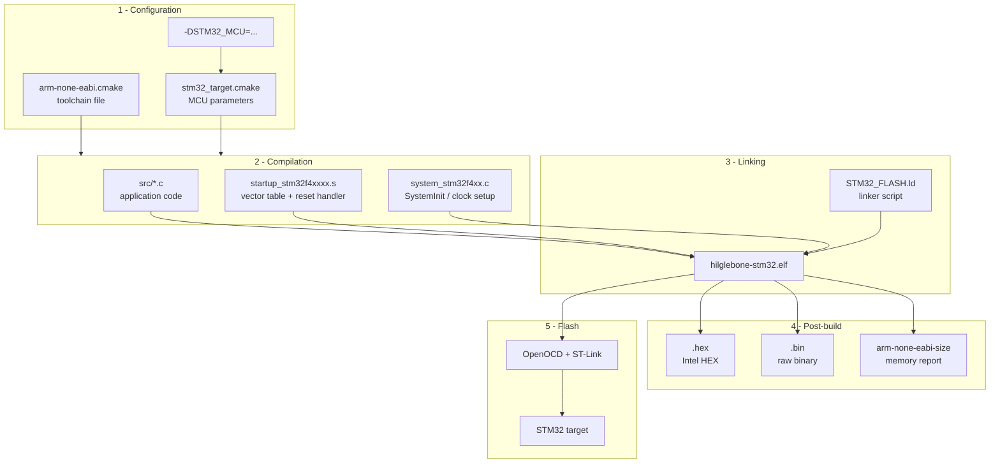
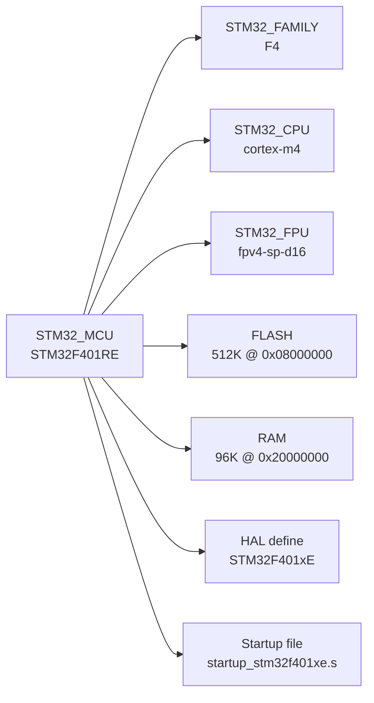
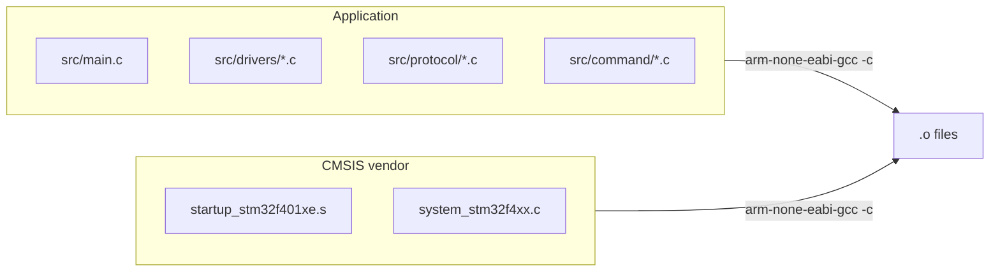
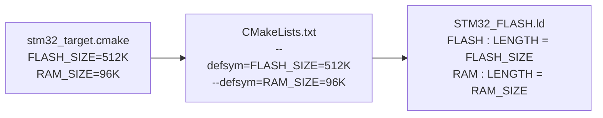
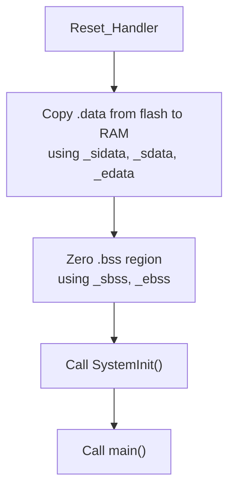
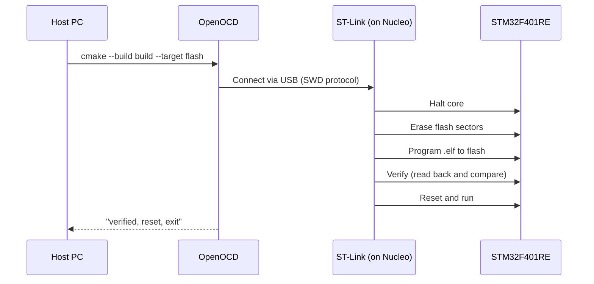

# STM32 Build & Flash Pipeline

How HILglebone firmware goes from source code to running on the MCU.

---

## Pipeline Overview



---

## Stage 1: Configuration

Configuration happens at CMake time, before any code is compiled. Two CMake modules
collaborate to detect the toolchain and map the selected MCU to its hardware parameters.

### Toolchain file -- `cmake/arm-none-eabi.cmake`

Loaded via `-DCMAKE_TOOLCHAIN_FILE` on the very first CMake invocation. It runs
**before** `project()` because CMake needs to know the compiler identity before it
can probe language support.

```
cmake -B build -DCMAKE_TOOLCHAIN_FILE=cmake/arm-none-eabi.cmake
```

What it does:

| Setting | Value | Why |
|---------|-------|-----|
| `CMAKE_SYSTEM_NAME` | `Generic` | Tells CMake this is a bare-metal target (no OS), disabling host-OS assumptions like linking against libc dynamically |
| `CMAKE_SYSTEM_PROCESSOR` | `arm` | Identifies the target architecture |
| `CMAKE_TRY_COMPILE_TARGET_TYPE` | `STATIC_LIBRARY` | CMake's compiler check normally builds a small executable -- that would fail on bare-metal because there is no `_exit`, `_sbrk`, etc. Building a static library skips the link step and avoids the false failure |
| `CMAKE_FIND_ROOT_PATH_MODE_*` | `ONLY` / `NEVER` | Prevents CMake from accidentally finding host libraries or headers when searching for dependencies. `NEVER` for programs (we want the host `make`), `ONLY` for libs/includes (we want ARM sysroot) |

The file locates `arm-none-eabi-gcc` on `PATH` (or via `-DARM_TOOLCHAIN_PATH`) and
derives all other tool paths (`objcopy`, `objdump`, `size`) from the same prefix
directory. If the compiler is missing, configuration fails with a clear install
instruction.

### Target configuration -- `cmake/stm32_target.cmake`

Included by `CMakeLists.txt` after `project()`. Maps the MCU part number to
concrete hardware parameters:

```
cmake -B build ... -DSTM32_MCU=STM32F401RE    # default
cmake -B build ... -DSTM32_MCU=STM32F446RE    # override
```



The family string (`F4`) is extracted from the part number with `string(SUBSTRING ...)`
and lowercased (`f4`). This drives all family-dependent paths in the build:

- CMSIS headers: `vendor/cmsis_device_f4/Include/`
- Startup assembly: `vendor/cmsis_device_f4/Source/Templates/gcc/`
- System init source: `vendor/cmsis_device_f4/Source/Templates/system_stm32f4xx.c`
- OpenOCD target config: `target/stm32f4x.cfg`

This means that supporting a new family (e.g., L4, H7) requires only:
1. Cloning the matching `cmsis_device_xx` submodule into `vendor/`
2. Adding an `elseif()` block in `stm32_target.cmake`

Currently pre-configured chips:

| MCU | CPU Core | Flash | RAM |
|-----|----------|-------|-----|
| **STM32F401RE** (default) | Cortex-M4 | 512K | 96K |
| STM32F411RE | Cortex-M4 | 512K | 128K |
| STM32F446RE | Cortex-M4 | 512K | 128K |
| STM32F407VG | Cortex-M4 | 1024K | 128K |

### Clock source -- `USE_HSE`

The PLL clock source is selected at build time via the `USE_HSE` CMake option:

```
cmake -B build ... -DUSE_HSE=ON     # default: use external HSE (8 MHz crystal/bypass)
cmake -B build ... -DUSE_HSE=OFF    # fall back to internal HSI (16 MHz RC)
```

| Option | PLL source | PLLM | VCO input | Accuracy |
|--------|-----------|------|-----------|----------|
| `USE_HSE=ON` (default) | HSE 8 MHz | 4 | 2 MHz | ~20 ppm (crystal) |
| `USE_HSE=OFF` | HSI 16 MHz | 8 | 2 MHz | ~1% (RC oscillator) |

Both paths produce the same 84 MHz SYSCLK (VCO input × 168 / 4). HSE is the
default because crystal-accurate timing is required for precise timer/PWM
frequencies and SPI/I2C clock rates when simulating sensors. HSI is available
as a fallback for boards without an external oscillator.

When `USE_HSE=ON`, CMake adds `-DUSE_HSE` to the compile definitions, and
`SystemClock_Config()` in `main.c` uses `#ifdef USE_HSE` to select the
appropriate clock initialization path.

---

## Stage 2: Compilation

`arm-none-eabi-gcc` compiles three groups of sources into object files:



### Compiler flags explained

The flags are composed in `CMakeLists.txt` from the target module's `STM32_CPU_FLAGS`
plus project-wide settings:

**CPU/architecture flags** (from `stm32_target.cmake`):

| Flag | Purpose |
|------|---------|
| `-mcpu=cortex-m4` | Generate code for the Cortex-M4 instruction set. Enables DSP instructions (saturating arithmetic, SIMD) that Cortex-M0 doesn't have |
| `-mthumb` | Use the Thumb-2 instruction set (16/32-bit mixed encoding). All Cortex-M cores run in Thumb mode -- ARM mode is not available |
| `-mfpu=fpv4-sp-d16` | Use the FPv4 single-precision hardware FPU with 16 double-word registers. Without this, float operations would compile to software emulation calls |
| `-mfloat-abi=hard` | Pass float arguments in FPU registers, not general-purpose registers. More efficient than `soft` or `softfp`, but every linked object must agree on the ABI |

**Warning and code quality flags**:

| Flag | Purpose |
|------|---------|
| `-Wall -Wextra` | Enable broad set of compiler warnings. Catches common mistakes (unused variables, implicit conversions, missing returns) |
| `-Werror` | Treat all warnings as errors. Prevents warning accumulation -- if it compiles, it's clean |

**Size optimization flags**:

| Flag | Purpose |
|------|---------|
| `-ffunction-sections` | Place each function in its own ELF section (`.text.function_name`). Enables the linker to discard unused functions individually |
| `-fdata-sections` | Same as above, but for global/static variables. Each variable gets its own section |
| `-fno-common` | Forbid tentative definitions for uninitialized globals. Without this, two files defining `int x;` silently merge -- with it, the linker catches the duplicate as an error |

**Runtime environment flags**:

| Flag | Purpose |
|------|---------|
| `-specs=nano.specs` | Link against newlib-nano instead of full newlib. Provides a minimal C library (~10x smaller `printf`, no `float` formatting by default) optimized for embedded targets |
| `-specs=nosys.specs` | Provide stub implementations for system calls (`_read`, `_write`, `_sbrk`, etc.). On bare-metal there is no OS to handle these, so the stubs return error codes or do nothing |

**Build-type flags**:

| Build Type | Flags | When to use |
|------------|-------|-------------|
| Debug (default) | `-Og -g3 -gdwarf-2` | During development. `-Og` optimizes without breaking the debugger. `-g3` includes maximum debug info (macros, inline functions). `-gdwarf-2` produces DWARF2 debug format (broadest tool compatibility) |
| Release | `-Os -DNDEBUG` | For production. `-Os` optimizes for smallest binary size (enables most `-O2` optimizations plus size-specific ones). `-DNDEBUG` disables `assert()` |

### Compile definitions

The target module exports `STM32F401xE` (or equivalent) as a preprocessor define via
`target_compile_definitions`. This is consumed by the CMSIS header `stm32f4xx.h` to
select the correct register definitions and peripheral memory map for the specific chip
variant. Additionally, `USE_HSE` is conditionally defined when the HSE clock source
is selected (see [Clock source](#clock-source----use_hse) above).

### Include paths

Three directories are added to the compiler's search path:

| Path | Contents |
|------|----------|
| `include/` | Project headers (drivers, protocol, command interfaces) |
| `vendor/cmsis_core/CMSIS/Core/Include/` | ARM CMSIS core: `core_cm4.h` (Cortex-M4 intrinsics, NVIC, SysTick), `cmsis_gcc.h` (compiler-specific builtins) |
| `vendor/cmsis_device_f4/Include/` | ST device headers: `stm32f4xx.h` (family), `stm32f401xe.h` (chip-specific register map), `system_stm32f4xx.h` |

---

## Stage 3: Linking

The linker combines all `.o` files into a single `.elf` executable, placing code and
data at the correct physical addresses for the target MCU.

### How memory geometry flows

The flash and RAM sizes are **not hardcoded** in the linker script. They flow from
the CMake target module through the linker command line into the script:



This keeps the linker script generic. Changing the MCU automatically adjusts the
memory layout without editing `STM32_FLASH.ld`.

### Linker flags explained

| Flag | Purpose |
|------|---------|
| `-T STM32_FLASH.ld` | Use our linker script instead of the toolchain default. The script defines memory regions and section placement |
| `-Wl,--gc-sections` | Garbage-collect unused sections. Works with `-ffunction-sections` / `-fdata-sections` to strip any function or variable that nothing references. Critical for keeping firmware small |
| `-Wl,--print-memory-usage` | Print flash/RAM usage after linking (used vs available). Shown during every build so the resource consumption can be tracked |
| `-Wl,--defsym=SYMBOL=VALUE` | Define a symbol at link time. Used to inject `FLASH_ORIGIN`, `FLASH_SIZE`, `RAM_ORIGIN`, `RAM_SIZE` into the linker script without modifying the file |

### Linker script -- `STM32_FLASH.ld`

Defines the memory map and section layout:

```
FLASH (512K @ 0x08000000)               RAM (96K @ 0x20000000)
+-----------------------------------+   +-----------------------------------+
| .isr_vector                       |   | .data                             |
| interrupt vector table            |   | initialized globals               |
+-----------------------------------+   | (copied from flash at startup)    |
| .text                             |   +-----------------------------------+
| program code                      |   | .bss                              |
+-----------------------------------+   | zero-initialized globals          |
| .rodata                           |   +-----------------------------------+
| constants, string literals        |   | heap                              |
+-----------------------------------+   |             grows up              |
| .data (load address)              |   +- - - - - - - - - - - - - - - - - +
| initial values for RAM variables  |   |            grows down             |
+-----------------------------------+   | stack                             |
                                        +-----------------------------------+
                                          _estack = top of RAM
```

Key sections:

| Section | Location | Purpose |
|---------|----------|---------|
| `.isr_vector` | Flash start | Interrupt vector table. Must be at `0x08000000` because the Cortex-M core reads the initial stack pointer and reset handler address from the first two words at this address after reset |
| `.text` | Flash | All executable code |
| `.rodata` | Flash | Read-only data (constants, string literals). Stays in flash to save RAM |
| `.data` | RAM (loaded from flash) | Initialized global/static variables. Stored in flash but copied to RAM by the startup code before `main()` runs. `_sidata` / `_sdata` / `_edata` symbols mark the source and destination |
| `.bss` | RAM | Zero-initialized globals. Not stored in flash -- the startup code zeroes this region using `_sbss` / `_ebss` symbols |
| Stack | Top of RAM, grows down | `_estack = ORIGIN(RAM) + LENGTH(RAM)` places the initial stack pointer at the top of RAM |

The script also reserves minimum sizes for heap (`0x200` = 512 bytes) and stack
(`0x400` = 1024 bytes). If `.data` + `.bss` + heap + stack would exceed RAM, the link
fails with a "region RAM overflowed" error.

### Startup sequence -- `startup_stm32f401xe.s`

This vendor-provided assembly file runs before `main()`:



It also defines the full interrupt vector table (`.isr_vector` section) with default
weak handlers that point to an infinite loop. Specific handlers can be overriden
by defining a function with the matching name (e.g., `USART1_IRQHandler`).

---

## Stage 4: Post-build

Three commands run automatically after every successful link:

```
arm-none-eabi-objcopy -O ihex   hilglebone-stm32.elf  hilglebone-stm32.hex
arm-none-eabi-objcopy -O binary hilglebone-stm32.elf  hilglebone-stm32.bin
arm-none-eabi-size              hilglebone-stm32.elf
```

| Output | Format | Use case |
|--------|--------|----------|
| `.elf` | ELF with debug symbols | Debugging (GDB + OpenOCD). Contains section headers, symbol table, debug info |
| `.hex` | Intel HEX (text) | Flashing via tools that expect addressed records (some bootloaders, production programmers) |
| `.bin` | Raw binary | Flashing via DFU or tools that write raw flash. Smallest output -- no metadata, just the bytes that go into flash |
| size output | Text (stdout) | Prints `text`, `data`, `bss` sizes so flash and RAM usage are visible at a glance during every build |

---

## Stage 5: Flashing

```
cmake --build build --target flash
```

This invokes OpenOCD with the ST-Link debug probe:



The OpenOCD command:

```
openocd -f interface/stlink.cfg -f target/stm32f4x.cfg \
        -c "program hilglebone-stm32.elf verify reset exit"
```

| Argument | Purpose |
|----------|---------|
| `-f interface/stlink.cfg` | Configure the debug adapter (ST-Link v2 or v2-1, SWD transport) |
| `-f target/stm32f4x.cfg` | Target description (flash banks, RAM, core type). The `f4x` portion is derived from `STM32_FAMILY_LOWER`, so it adapts if the MCU is changed |
| `program ... verify reset exit` | Single compound command: write the ELF to flash, verify contents match, issue a hardware reset so firmware starts executing, then quit OpenOCD |

---

## Complete file map

```
stm32/
├── cmake/
│   ├── arm-none-eabi.cmake     Toolchain: locates cross-compiler, sets bare-metal mode
│   └── stm32_target.cmake      Target: maps MCU part number → CPU, flash, RAM, CMSIS
├── vendor/                     Git submodules (do not edit)
│   ├── cmsis_core/             ARM CMSIS: core_cm4.h, NVIC, SysTick intrinsics
│   └── cmsis_device_f4/        ST CMSIS: register maps, startup .s files, system init
├── include/                    Project headers
├── src/
│   ├── main.c                  Entry point
│   ├── drivers/                Peripheral drivers (GPIO, UART, I2C, SPI, PWM, DAC)
│   ├── protocol/               UART wire protocol codec
│   └── command/                Command parser and execution
├── CMakeLists.txt              Build script: ties everything together
└── STM32_FLASH.ld              Linker script: memory layout (generic, parameterized)
```

---

## Quick reference

```bash
# Configure (once, or after changing MCU)
cmake -B build -DCMAKE_TOOLCHAIN_FILE=cmake/arm-none-eabi.cmake

# Configure for a different chip
cmake -B build -DCMAKE_TOOLCHAIN_FILE=cmake/arm-none-eabi.cmake -DSTM32_MCU=STM32F411RE

# Configure with internal HSI oscillator (no external crystal)
cmake -B build -DCMAKE_TOOLCHAIN_FILE=cmake/arm-none-eabi.cmake -DUSE_HSE=OFF

# Build
cmake --build build

# Flash
cmake --build build --target flash

# Clean rebuild
cmake --build build --target clean
cmake --build build
```
